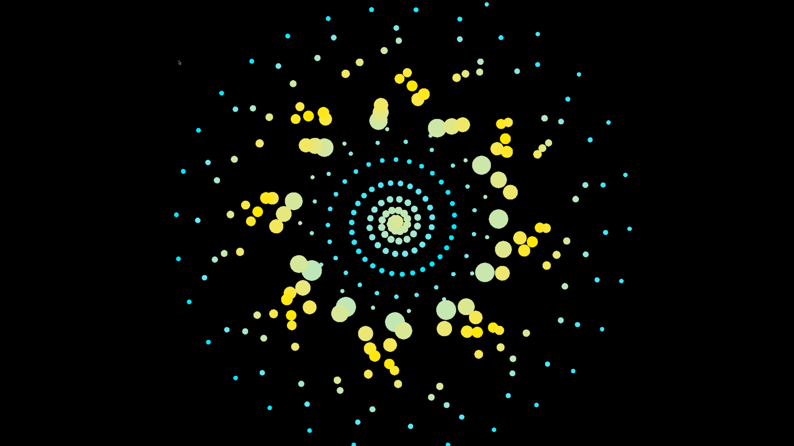

Three-day intensive held at ISRO Bengaluru, February 2026.
Each day builds on the last without repeating it.

Day 1 covers three physical modelling synthesis networks and four stochastic timing strategies.
Visuals read audio state directly: the same buffer, different interpretation.
Day 2 keeps one drum engine and escalates the visual side through five architectures,
from energy meters to physics-driven particle systems where audio events create and destroy spatial structure.
Day 3 moves computation to the GPU: push constants, storage buffers, camera input, vertex deformation from audio.
The CPU generates sound and passes numbers across. The shader decides what they look like.

<h3>Workshop Days</h3>

<ul>
<li><a href="./day_1/">Day 1</a></li>
<li><a href="./day_2/">Day 2</a></li>
<li><a href="./day_3/">Day 3</a></li>
</ul>

<h3>Code</h3>

Click to Download 
<ul>
<li><a href="/day1/day1.zip" download>Day 1 Code</a></li>
<li><a href="./code/day-2/">Day 2 Code</a></li>
<li><a href="./code/day-3/">Day 3 Code</a></li>
</ul>

The following is the original workshop poster.
It is presented here as-is, without modification.

## Brief

<!--  -->


Learn computational audio-visual thinking through MayaFlux, a framework where sound and image emerge from the same numerical processes.

This isn’t audio visualization or generative art. You’re not mapping sound to graphics or decorating one with the other. You’re designing systems where numbers flow through a unified infrastructure and manifest as both sound and image at the same time.

The pattern that makes a spiral can also make a tone. A feedback loop can shape rhythm and geometry together. Chaos, recursion, and randomness are not effects; they’re behaviours you work with directly.

You’ll begin by running complete, working systems: recursive delay networks, chaotic attractors, stochastic fields. You’ll hear them and see them simultaneously. Then you’ll change parameters, swap components, and watch how behaviour shifts. We don’t build up from simple exercises. We start with systems that already do something interesting and unravel their logic through experimentation.

No oscillator-to-ADSR tutorials.
No circle-drawing dopamine loops.

The goal isn’t to explain every line of code. It’s to understand what the system is doing conceptually: how numbers feed back into themselves, interfere, destabilize, and reorganize. Code is just how we speak to the machine.

Programming experience helps, but it’s not the point. What matters more is willingness to get lost in complexity, tolerate things breaking, and let go of familiar metaphors from older tools. This is about learning to think digitally, on the computer’s terms, rather than forcing it to imitate past media.

Curiosity matters more than credentials. Comfort with “I don’t know yet” is essential.

## Questions you're probably asking

**“This sounds complicated.”**
The systems you’ll run are complex. You’re not expected to understand them immediately. You run them first, then change numbers, swap parts, and observe what shifts. Understanding grows from curiosity, not prerequisites.

**“Do I need math or programming experience?”**
No. They help, but they’re not required. Investigation here means changing values, replacing components, and noticing differences. You’re exploring ideas through code, not training to become a programmer.

**“What does ‘unravel’ mean?”**
Understanding what a system is doing conceptually, not line by line. A delay network isn’t “code that makes echo sounds.” It’s numbers feeding back into themselves and creating interference. Once you see that, you can combine it with other ideas. Code is just how we talk to the machine.

**“Why not start with primitives and units?”**
Because simple examples teach a tool’s habits. We want you thinking in terms of behaviour, emergence, and transformation. Complex systems that already work let you explore freely without getting lost in setup.

---

## Who this is for

You’re curious about what computers can do beyond imitating older tools. You’re willing to spend time confused before things click. You want to think differently about digital creation, not just learn new software.

Maybe you’ve used Processing and felt boxed in by the canvas metaphor.
Maybe you’ve used Max/MSP and wondered why audio and video never really talk.
Maybe you’ve never coded, but you’re tired of presets.

This workshop assumes:

- You can tolerate not knowing things yet
- You’re interested in how systems behave, not just outcomes
- You’re okay with things breaking, because that’s how we learn what they do

This isn’t for you if:

- You want step-by-step tutorials with guaranteed results
- You need everything explained before trying it
- You’re looking for quick wins or portfolio pieces
- You think “difficult” means “badly designed”

We’re teaching a perspective shift. The code is just the medium. If you’re game for that, welcome.

---

## How the three days unfold

**Day 1 : See it working**
You run recursive temporal systems: delay networks that produce sound and visuals from the same process. You change parameters, observe interference, and build intuition through direct manipulation. By the end of the day, “recursive system” is something you’ve experienced, not memorized.

**Day 2 : One process, multiple outputs**
The same mathematics drives speakers and screen. This is not visualization of audio. It’s a single process expressed in different forms. You swap chaos for randomness, delays for grains, and watch how changes propagate. The idea that audio and graphics are separate starts to dissolve.

**Day 3 : Make it yours**
Open exploration. You choose the direction: particles, fractals, resonance, distortion. I’m there to unblock you, not steer you. We end by sharing surprises, not successes.

---

## Practical requirements

### **Participants**

- Laptop (macOS, Linux, or Windows, admin rights required)
- Headphones
- MayaFlux installed beforehand (guide sent in advance, takes about 5-30 minutes depending on machine and internet)

**Note:** Installation help available at workshop. Pre-installing just lets us focus on ideas, not setup.

### Installation:
Removed original outdated instructions. 
Visit [download page](https://www.mayaflux.org/download) for updated instructions .

### Duration

Understanding through experimentation takes time.
Compiler errors are part of learning.
Breaks prevent burnout. So this takes three days.

### Contact

Please reach out to mayafluxcollective@proton.me for ANY questions regarding installation or other related issues.

